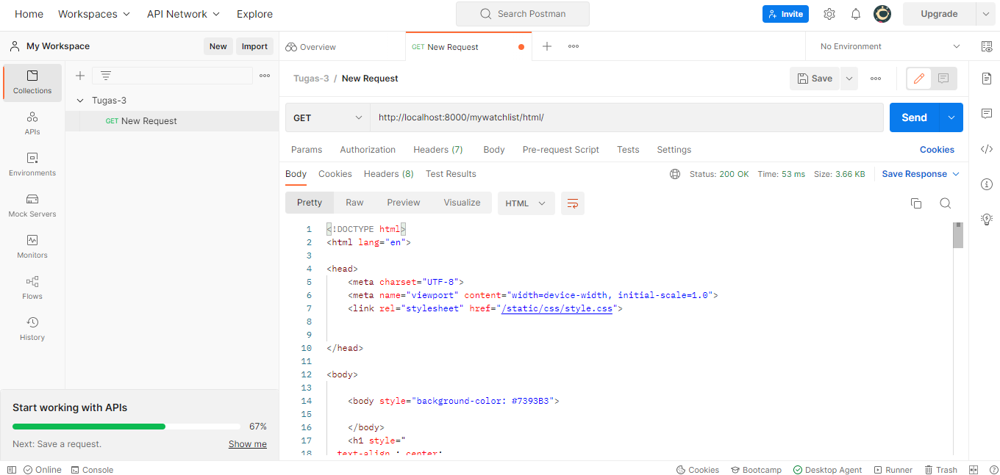

## Link Aplikasi
https://katalog-item.herokuapp.com/mywatchlist/

## Postman

## Perbedaan JSON, XML, dan HTML
JSON (JavaScript Object Notation) merupakan sebuah format untuk menyimpan dan merepresentasikan data. Struktur dari JSON diturunkan dari syntax JavaScript. Ukuran JSON lebih ringan sehingga proses pengiriman dan pembuatannya lebih cepat.

XML (Extensible Markup Language) merupakan sebuah bahasa markup yang digunakan untuk menyederhanakan proses penyimpanan data. XML menggunakan struktur tag untuk merepresentasikan data. Dibandingkan JSON, dokumen XML lebih sulit untuk dibaca dan dimengerti.

HTML (Hypertext Markup Language) juga merupakan bahasa markup untuk menyusun struktur sebuah aplikasi web. Perbedaan XML dan HTML adalah HTML lebih berfungsi untuk menampilkan data, sedangkan XML untuk menyimpan dan mentransfer data.

## Mengapa Data Delivery Dibutuhkan?
Data delivery dibutuhkan untuk pertukaran data antar client dan server dalam sebuah aplikasi. Pertukaran data tersebut biasanya menggunakan format JSON, XML, dan HTML. Adanya data delivery juga memungkinkan data dikemas dan dikirimkan dalam bentuk yang bisa dipahami manusia dan komputer.
 
## Cara Mengimplementasikan Checklist Tugas 3
Seperti lab dan tugas sebelumnya, pertama saya membuat sebuah aplikasi baru bernama mywatchlist. Lalu saya membuat file initial_mywatchlist_data.json untuk menampung semua data yang akan ditampilkan.

Setelah itu, saya membuat models yang akan ditampilkan pada aplikasi ini, yaitu *watched, title, rating, release_date, review*. Kemudian, saya membuat sebuah file initial_mywatchlist_data.json untuk menampung data-data dari models tersebut. Setelahnya baru saya membuat sebuah file html yang akan menjadi struktur dari aplikasi ini. Kemudian saya juga menyelesaian views dan routing.

**Data Delivery** 
Tambahan terbaru untuk aplikasi ini adalah menyajikan data dalam format xml dan json. Untuk tahapan ini, pertama saya membuat fungsi-fungsi show_xml dan show_json di file views.py. Kemudian, saya menambahkan path pada urls.py agar kita bisa mengakses http://localhost:8000/mywatchlist/xml/ dan http://localhost:8000/mywatchlist/json/